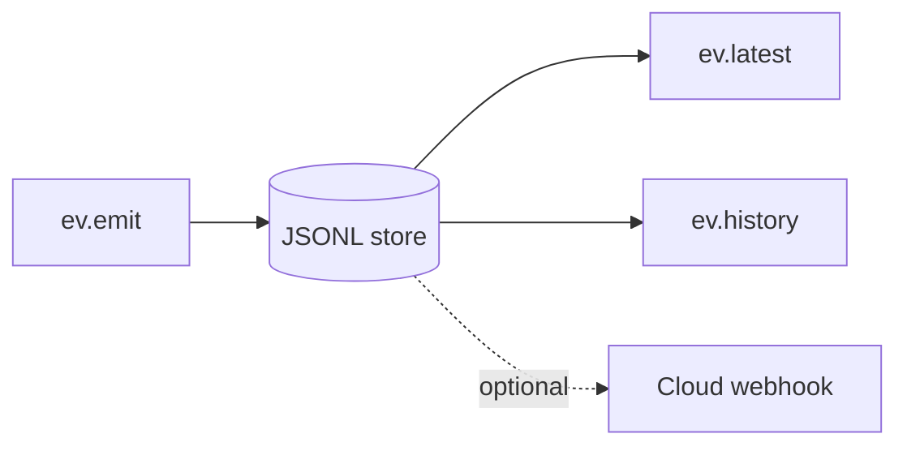
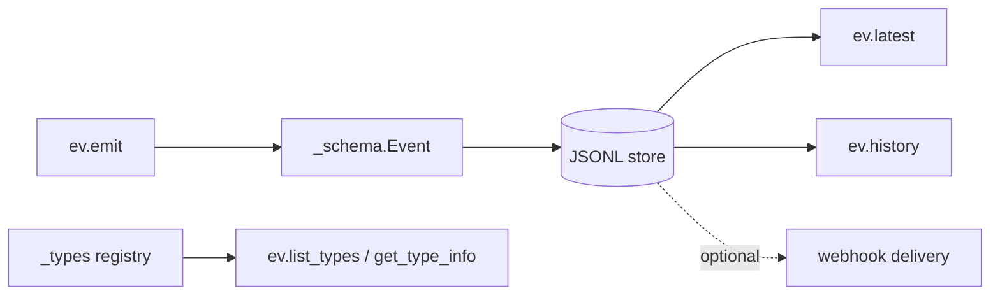

# scitex-events

<p align="center">
  <a href="https://scitex.ai">
    
  </a>
</p>

<p align="center"><b>Zero-dep async event bus for the SciTeX ecosystem.</b></p>

<p align="center">
  <a href="https://scitex-events.readthedocs.io/">Full Documentation</a> · <code>uv pip install scitex-events[all]</code>
</p>

<!-- scitex-badges:start -->
<p align="center">
  <a href="https://pypi.org/project/scitex-events/"></a>
  <a href="https://pypi.org/project/scitex-events/"></a>
  <a href="https://github.com/scitex-ai/scitex-events/actions/workflows/ci.yml"></a>
  <a href="https://scitex-events.readthedocs.io/en/latest/"></a>
</p>
<p align="center">
  <a href="https://github.com/scitex-ai/scitex-events/actions/workflows/ci.yml"></a>
  <a href="https://github.com/scitex-ai/scitex-events/actions/workflows/ci.yml"></a>
  <a href="https://codecov.io/gh/scitex-ai/scitex-events"></a>
</p>
<!-- scitex-badges:end -->

---

## Quick Start

```python
import scitex_events as ev

ev.emit("test_complete", project="figrecipe", status="success",
        payload={"exit_code": 0, "module": "stats"})

ev.latest("test_complete")     # most recent event of this type
list(ev.history(limit=20))     # recent history
```

## Demo



<p align="center"><sub><b>Figure 1.</b> Demo path. One emit call lands in the JSONL store and is immediately readable via latest/history.</sub></p>

## Installation

```bash
uv pip install "scitex-events[all]"
```

<details>
<summary><b>Per-module extras</b></summary>

<br>

| Extra | Pulls in |
|---|---|
| `all` | `dev` + `docs` (recommended) |
| `dev` | pytest, pytest-cov, pytest-timeout, ruff |
| `docs` | Sphinx + RTD theme + myst-parser (docs build only) |

```bash
uv pip install -e ".[dev]"               # editable install for contributors
```

</details>
## Architecture



<p align="center"><sub><b>Figure 2.</b> Event flow. Emission validates against the schema, appends to the local JSONL store, and fans out to readers plus an optional webhook.</sub></p>

## 1 Interfaces

<details open>
<summary><strong>Python API</strong></summary>

<br>

```python
import scitex_events as ev

# Emit an event (any kwargs become payload fields).
ev.emit("test_complete", project="figrecipe", status="success",
        payload={"exit_code": 0, "module": "stats"})

# Latest event of a given type.
ev.latest("test_complete")

# Recent history (newest first).
list(ev.history(limit=20))

# Schemas / introspection.
ev.list_types()
ev.get_type_info("test_complete")
```

Events are stored locally as JSON-Lines files under `~/.scitex/events/runtime/`
(resolved via `local_state.runtime_path("events")`) and can optionally be forwarded
to a cloud webhook.

</details>

## Status

Standalone fork of `scitex.events`. Pure stdlib — zero runtime deps except
`scitex-config` (canonical local-state directory resolver per the SciTeX
local-state directories skill). The umbrella package's `scitex.events` import
path is preserved via a `sys.modules`-alias bridge so existing code continues
to work.

## Part of SciTeX

`scitex-events` is part of [**SciTeX**](https://scitex.ai). Install via
the umbrella with `pip install scitex[events]` to use as
`scitex.events` (Python) or `scitex events ...` (CLI).

>Four Freedoms for Research
>
>0. The freedom to **run** your research anywhere — your machine, your terms.
>1. The freedom to **study** how every step works — from raw data to final manuscript.
>2. The freedom to **redistribute** your workflows, not just your papers.
>3. The freedom to **modify** any module and share improvements with the community.
>
>AGPL-3.0 — because we believe research infrastructure deserves the same freedoms as the software it runs on.

## License

AGPL-3.0-only (see [LICENSE](./LICENSE)).

---

<p align="center">
  <a href="https://scitex.ai" target="_blank"></a>
</p>
